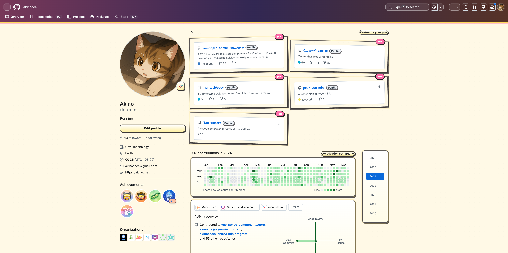

# GitHub Restyle

<p align="center">
  
</p>

一个 Chrome 扩展，用于重新定义 Github 主题。

## 效果预览



## 安装

GitHub Restyle 通过 GitHub Release 发布 zip 压缩包。用户可以手动安装到 Chrome 浏览器中：

1. 打开本仓库的 GitHub Releases 页面。
2. 下载最新版本里的 `github-restyle-vX.Y.Z.zip` 文件。
3. 将 zip 解压到本地文件夹。
4. 在 Chrome 地址栏打开 `chrome://extensions`。
5. 开启右上角的「开发者模式」。
6. 点击「加载已解压的扩展程序」。
7. 选择刚才解压出来的文件夹。
8. 打开 GitHub，点击 GitHub Restyle 扩展图标切换主题。

更新时，下载新的 release zip，重新解压后，在 `chrome://extensions` 页面点击该扩展卡片上的「重新加载」。

## 使用

GitHub Restyle 只会在 `https://github.com/*` 页面生效。

当前可用主题：

- `github-default`：关闭皮肤，保留 GitHub 原始样式。
- `vivid-light`：默认的明亮主题。

## 贡献主题

主题通过注册表扩展。每个主题必须有稳定的 `id` 和展示给用户看的 `name`，`id` 使用小写英文、数字和连字符，因为它会写入 `chrome.storage`。

新增主题时：

1. 在 `src/content/styles/` 下新增以主题 `id` 命名的文件夹，例如 `src/content/styles/your-theme-id/`。
2. 在主题文件夹内新增 `index.css`，并用 `:root[data-github-restyle-theme='your-theme-id']` 作为样式入口。需要拆分页面样式时，放在同一个主题文件夹内，再由 `index.css` 导入。
3. 在 `src/content/main.ts` 引入主题入口 CSS，例如 `import './styles/your-theme-id/index.css';`。
4. 在 `src/shared/theme-contributions.ts` 里调用 `registerThemes` 注册主题：

```ts
registerThemes([
  {
    id: 'your-theme-id',
    name: 'Your Theme Name',
    description: 'A short description shown in the popup.',
    cssEntry: 'your-theme-id',
    contributor: 'your-name',
  },
]);
```

## 本地开发

```bash
pnpm install
pnpm run build
```

构建完成后，在 `chrome://extensions` 开启开发者模式，并加载生成的 `dist` 目录。
